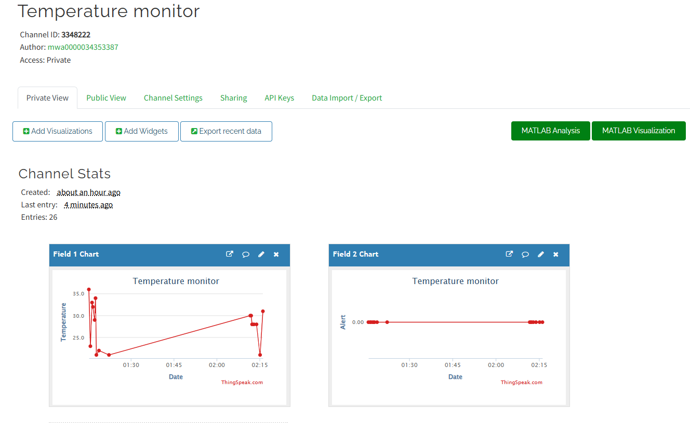
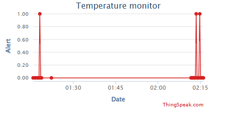
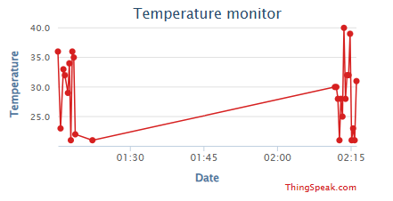
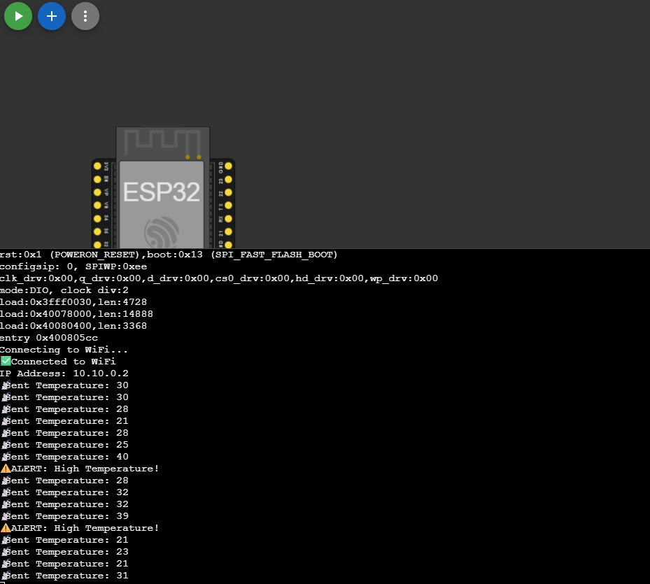

# 🌡️ IoT Temperature Monitoring System (MicroPython)

## 📌 Overview
This project simulates an IoT-based temperature monitoring system using ESP32 and ThingSpeak.

## ⚙️ Features
- Simulated temperature data
- Cloud integration
- Real-time graph
- Alert system

## 🛠️ Tech Used
- ESP32 (Wokwi)
- MicroPython
- ThingSpeak

## 🚀 Output
- Temperature graph on ThingSpeak

## 📸 Screenshots

### Graph Output

### Serial Output
